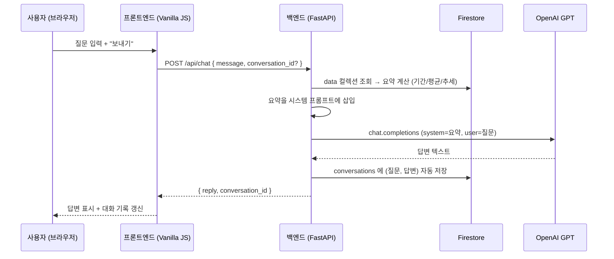

# 나만의 AI 비서 — 대전 상권 데이터 챗봇

> 대전 82개 행정동의 상권 점포수 시계열 데이터를 이해하고, 그 데이터를 근거로 맞춤형 답변을 주는 AI 비서 서비스.
> 코디세이 AI Native Advanced · **"AI Agent 개발: 나만의 AI 비서 구축"** 미션 결과물.

    

---

## 1. 서비스 소개 — 무엇을 해결하는가

일반적인 ChatGPT는 **내 데이터를 모릅니다.** "이번 분기 상권이 어때?"라고 물어도 일반론만 돌아옵니다.

이 서비스는 그 간극을 이렇게 메웁니다.

1. 시계열 데이터(대전 행정동별 점포수 추이)를 분석해 **요약 정보**를 만든다 — 기간·개수·평균/최대/최소·추세.
2. 그 요약을 매 대화마다 **AI의 시스템 프롬프트에 주입(컨텍스트 주입)** 한다.
3. 그 결과 AI는 "내 상황을 아는" 답변을 한다.

여기에 데이터 CRUD, 대화 기록 저장/불러오기까지 붙여 **하나의 완결된 애플리케이션**으로 만들었습니다. 데이터를 수정하면 다음 대화부터 AI 답변이 바뀝니다.

---

## 2. 기술 스택

| 영역 | 기술 | 선택 이유 |
|---|---|---|
| 백엔드 | **FastAPI** (Python 3.10+) | 자동 OpenAPI 문서(`/docs`), Pydantic 기반 요청 검증이 기본 제공 |
| 데이터베이스 | **Firebase Firestore** | 서버리스 문서 DB, 스키마 유연, 서비스 계정 키만으로 서버에서 접근 |
| AI | **OpenAI GPT API** (`gpt-4o-mini`) | 컨텍스트 주입 방식 — 파인튜닝 없이 시스템 프롬프트로 도메인 지식 전달 |
| 프론트엔드 | **바닐라 HTML/CSS/JavaScript** | 프레임워크 미사용 (미션 제약). 빌드 스텝은 환경변수 주입용 1개 스크립트뿐 |
| 배포 | 백엔드 **Render**, 프론트 **Vercel** | 둘 다 GitHub 연동 무료 티어 |

---

## 3. 배포 URL

| 대상 | URL |
|---|---|
| 프론트엔드 | **https://frontend-lovat-rho-rea8xhh8wq.vercel.app** |
| 백엔드 API | **https://my-data-assistant.onrender.com** |
| Swagger UI | **https://my-data-assistant.onrender.com/docs** |

> ⚠️ **콜드 스타트 안내**: 백엔드는 Render 무료 플랜이라 15분간 요청이 없으면 잠듭니다. 이후 첫 요청은 응답까지 **30~50초** 걸리고, 그동안 프론트엔드는 로딩 표시를 유지합니다. 한 번 깨어나면 이후 요청은 즉시 응답합니다.

---

## 4. 핵심 동작 흐름 — `/api/chat` 컨텍스트 주입



핵심은 **"요약을 매 호출마다 다시 계산해서 주입"** 한다는 점입니다. 데이터가 바뀌면 다음 대화부터 즉시 반영됩니다.

---

## 5. 데이터 선정 및 분석

같은 학습 단계의 이전 프로젝트 [daejeon-commercial-analysis](https://github.com/Frost0313z/daejeon-commercial-analysis)(대전 상권 데이터 분석)에서 만든 `dong_indicators_timeseries.csv`를 재사용합니다.

- **원본**: 대전 82개 행정동 × 6개 분기(2025-03 ~ 2026-06)의 점포수
- **변환**: `backend/scripts/prepare_seed_data.py`가 행정동×분기를 개별 레코드로 풀어 **`(date, value, memo)` 492개**로 변환 → `backend/app/seed/seed_data.json`
- **적재**: `backend/scripts/seed_firestore.py`가 이 JSON을 Firestore `data` 컬렉션에 배치 write

| 필드 | 의미 | 예 |
|---|---|---|
| `date` | 조사 시점 (분기 단위) | `2025-03-01` |
| `value` | 해당 행정동의 점포수 | `1930` |
| `memo` | "구 동 (주력업종: OO업)" | `동구 중앙동 (주력업종: 소매업)` |

**요약 계산** (`GET /api/data/summary`): 레코드를 날짜순 정렬 후 기간·개수·평균/최대/최소, 그리고 추세를 **앞 절반 평균 vs 뒤 절반 평균**으로 판정(증가/감소/유지)합니다. 현재 시드 기준: 기간 `2025-03-01 ~ 2026-06-01`, 492개, 평균 `958.3`, 최대/최소 `3444 / 98`, 추세 `유지`.

---

## 6. API 엔드포인트

| 메서드 | 경로 | 설명 |
|---|---|---|
| GET | `/api/data` | 데이터 목록 조회 |
| POST | `/api/data` | 데이터 추가 (Pydantic 검증: `value`는 숫자) |
| PUT | `/api/data/{id}` | 데이터 수정 |
| DELETE | `/api/data/{id}` | 데이터 삭제 |
| GET | `/api/data/summary` | 요약 정보 (프롬프트 주입용) |
| GET | `/api/conversations` | 대화 목록 조회 (목록에는 `messages` 생략) |
| POST | `/api/conversations` | 대화 통째로 저장 (보조 경로) |
| GET | `/api/conversations/{id}` | 대화 상세 — `messages` 전체 포함 (**불러오기용**) |
| DELETE | `/api/conversations/{id}` | 대화 삭제 |
| POST | `/api/chat` | AI 채팅 (요약 조회 → 시스템 프롬프트 주입 → GPT 호출 → 대화 자동 저장) |

`GET /api/conversations`는 목록 응답에서 `messages`를 `null`로 생략하고, 개별 대화를 열 때 `GET /api/conversations/{id}`로 전체 메시지를 가져옵니다(미션 옵션 A).

---

## 7. 화면 구성 (프론트엔드)

한 페이지에 4개 영역:

- **데이터 요약** (사이드바) — 현재 요약 정보: 기간 / 레코드 수 / 평균 / 최대·최소 / 트렌드
- **대화 기록** (사이드바) — 저장된 대화 목록, 클릭 시 해당 대화를 채팅창에 복원, 개별 삭제
- **채팅** (메인) — 메시지 입력, 대화 표시, 요청 중 로딩 표시, "새 대화" 버튼
- **데이터 관리** (메인) — `(날짜, 값, 메모)` 추가 폼, 목록 테이블, 행별 수정/삭제

---

## 8. 제출 스크린샷

> 코디세이 AI 사전평가는 이미지를 읽지 못하므로, 각 스크린샷 아래에 **입력 → 실제 출력**을 텍스트로 함께 적는다.

### 8-1. 데이터 요약이 반영된 채팅 화면 (질문 + 답변)


- **입력(질문)**: "대전 상권 데이터에서 평균 점포수랑 최근 추세를 알려주고, 창업 관점에서 한 줄 조언도 해줘."
- **사이드바 요약**: 기간 `2025-03-01 ~ 2026-06-01`, 레코드 수 `492개`, 평균 `958.3`, 최대/최소 `3444 / 98`, 트렌드 `유지`
- **AI 실제 답변(발췌)**: "대전 상권 데이터의 평균 점포 수는 **958.3개**로 나타났습니다. 최근 추세는 **유지**되고 있다는 점에서, 현재 상권의 안정성을 엿볼 수 있습니다. … 안정적인 상권 트렌드를 활용해 특화된 제품이나 서비스를 제공하는 것이 경쟁력을 높일 수 있을 것입니다."
- **확인 포인트**: 답변의 `958.3`, `유지`는 프런트가 만든 값이 아니라 **백엔드가 `/api/data/summary`를 계산해 시스템 프롬프트로 주입한 값**이 그대로 반영된 것.

### 8-2. 데이터 관리 화면 (CRUD 동작)


- **추가(Create)**: 폼에 `2026-09-01 / 1234 / "데모: 신규 상권 데이터 추가 테스트"` 입력 → "추가" → 목록에 493번째 행으로 나타남.
- **수정(Update)**: 그 행의 "수정" → 폼이 값으로 채워지고 버튼이 "수정 저장"으로 바뀜 → 값을 `1234 → 5678`, 메모를 "데모: 수정 동작 확인"으로 바꿔 저장 → 목록에 반영됨.
- **삭제(Delete)**: 각 행의 "삭제" 버튼. (스크린샷 촬영 후 데모용 레코드는 삭제해 시드 492개 상태로 되돌림.)
- Pydantic 검증: `value`에 문자열을 넣으면 `422 Unprocessable Entity`.

### 8-3. 대화 기록 불러오기 화면


- **상황**: 대화 2건 저장됨 — ① "점포수가 가장 많은 지역과 가장 적은 지역의 차이가 큰…" ② "대전 상권 데이터에서 평균 점포수랑 최근 추세를 알려주…"
- **동작**: 사이드바 "대화 기록"에서 ②를 클릭 → 채팅창에 ②의 질문·답변 전체가 복원됨(`GET /api/conversations/{id}`).
- **확인 포인트**: 목록 항목의 제목이 정상 표시되고, 클릭 한 번으로 과거 대화가 그대로 재현됨.

### 8-4. 모바일 화면 — 채팅 (뷰포트 390×844, iPhone 12 상당)


- **레이아웃**: 데스크톱의 좌측 사이드바(요약·대화 기록)가 상단으로 접히고, 채팅·데이터 관리가 세로 1열로 쌓임.
- **채팅 입력**: `.chat-input-row`가 세로로 전환돼 입력창과 "보내기" 버튼이 각각 가로 전체를 차지(터치 타깃 확보).
- **동작 확인**: 모바일 뷰에서 "모바일에서 잘 되나 확인 중…" 질문 전송 → AI가 `기간 2025년 3월 1일 ~ 2026년 6월 1일, 평균 958.3` 응답. 말풍선 `max-width: 85%`로 화면 밖으로 넘치지 않음.

### 8-5. 모바일 화면 — 데이터 관리 (반응형 폼)


- **추가 폼**: `.data-form`이 `flex-direction: column`으로 전환돼 날짜/값/메모 입력이 한 줄에 하나씩, "추가" 버튼은 가로 전체.
- **넓은 표**: `.data-table`이 `display: block; overflow-x: auto`로 바뀌어 표만 가로 스크롤되고, **페이지 자체는 가로 스크롤이 생기지 않음**(`document.documentElement.scrollWidth === window.innerWidth === 390` 확인).

### 8-6. 반응형 CSS 미디어쿼리 (`frontend/css/style.css`)

2단계 브레이크포인트로 대응한다.

| 브레이크포인트 | 목적 | 주요 변경 |
|---|---|---|
| `@media (max-width: 800px)` | 태블릿 이하 | `.layout`을 `flex-direction: column`으로 → 사이드바가 상단으로 |
| `@media (max-width: 560px)` | 모바일 | 폼(`.data-form`)·채팅 입력(`.chat-input-row`)을 세로 1열로, 버튼 가로 전체(패딩 확대로 터치 타깃 ≥44px), 데이터 표는 `overflow-x: auto`로 가로 스크롤, 말풍선 `max-width: 85%`, 컨테이너 패딩 축소 |

```css
@media (max-width: 560px) {
  .data-form { flex-direction: column; align-items: stretch; }
  .data-form input, .data-form button { width: 100%; }
  .data-table { display: block; overflow-x: auto; white-space: nowrap; }
  .chat-input-row { flex-direction: column; }
  .chat-input-row button { width: 100%; padding: 12px; }
  .bubble { max-width: 85%; }
  button { padding: 10px 14px; }
}
```

Chrome DevTools 모바일 에뮬레이션(390×844, `isMobile: true`, `hasTouch: true`)에서 요약 로드·채팅 전송·데이터 폼이 모두 정상 동작하고 가로 오버플로가 없음을 확인했다.

---

## 9. 로컬 실행 방법

### 백엔드

```bash
cd backend
python -m venv venv
venv\Scripts\activate          # Windows (macOS/Linux: source venv/bin/activate)
pip install -r requirements.txt
cp .env.example .env           # 값 채우기 (아래 10번 참고)
python scripts/seed_firestore.py   # 최초 1회: 시드 492개 적재
uvicorn main:app --reload
```

`http://localhost:8000/docs` 에서 Swagger UI 확인.

### 프론트엔드

`frontend/index.html`을 정적 서버로 서빙합니다(VSCode Live Server 등). 로컬에서는 `js/config.js`의 기본값 `http://localhost:8000`이 그대로 쓰입니다.

배포 시에는 `frontend/build.js`가 Vercel 빌드 환경변수 `API_BASE_URL`을 읽어 `js/config.js`의 플레이스홀더를 실제 백엔드 주소로 치환합니다.

---

## 10. 환경 변수 (최소 세트)

| 변수 | 위치 | 필수 | 설명 |
|---|---|:---:|---|
| `OPENAI_API_KEY` | 백엔드 | ✅ | OpenAI API 키 (`sk-...`) |
| `FIREBASE_SERVICE_ACCOUNT_JSON` | 백엔드 | ✅ | 서비스 계정 키 — **로컬은 파일 경로**, **Render는 JSON 문자열 전체** |
| `ALLOWED_ORIGINS` | 백엔드 | ✅ | CORS 허용 오리진(콤마 구분). 프론트 배포 URL 포함 |
| `OPENAI_MODEL` | 백엔드 |  | 기본값 `gpt-4o-mini` |
| `CHAT_MAX_TOKENS` | 백엔드 |  | 응답 토큰 상한 (기본 `500`, 과금 방지) |
| `API_BASE_URL` | 프론트엔드(Vercel) | ✅ | 백엔드 배포 URL. 빌드 시 `build.js`가 `js/config.js`에 주입 |

`.env`와 `firebase-service-account.json`은 `.gitignore`에 포함되어 저장소에 올라가지 않습니다.

---

## 11. 프로젝트 구조

```
my-data-assistant/
├── backend/
│   ├── main.py                  # FastAPI 앱 초기화 + CORS + 라우터 등록
│   ├── app/
│   │   ├── config.py            # 환경변수 로딩 (python-dotenv)
│   │   ├── firestore_client.py  # 서비스 계정(파일 or JSON 문자열)로 Firestore 초기화
│   │   ├── models.py            # Pydantic 요청/응답 스키마
│   │   ├── routers/             # data / conversations / chat — HTTP 계약만
│   │   ├── services/            # Firestore·OpenAI 호출 등 실제 로직
│   │   └── seed/seed_data.json  # 시드 데이터 492개
│   ├── scripts/
│   │   ├── prepare_seed_data.py # 원본 CSV → 시드 JSON
│   │   └── seed_firestore.py    # 시드 JSON → Firestore 적재
│   └── requirements.txt
└── frontend/
    ├── index.html
    ├── css/style.css
    ├── js/                      # config·api·summary·chat·data·history
    ├── build.js                 # 배포 시 API_BASE_URL 주입
    └── vercel.json
```

---

## 12. 설계 노트

- **데이터 구조를 이렇게 선택한 이유**: 미션이 요구하는 `(date, value, memo)` 단순 시계열 스키마에 맞추면서도, 이미 검증된 실제 분석 데이터(대전 상권)를 재사용해 "억지로 만든 숫자"가 아닌 의미 있는 데이터를 쓰고 싶었습니다. 행정동×분기를 개별 레코드로 풀어 492개를 확보했습니다.
- **컨텍스트 주입 흐름**: `/api/chat`은 매 호출마다 `/api/data/summary`를 다시 계산해 시스템 프롬프트에 넣습니다. 데이터가 바뀌면 다음 대화부터 즉시 반영됩니다. 프롬프트 크기를 일정하게 유지하려고 원본 492행이 아니라 **요약 통계만** 주입합니다.
- **라우터/서비스 분리 기준**: 라우터는 HTTP 계약(경로·요청/응답 스키마)만 담당하고, Firestore·OpenAI 호출 등 실제 로직은 `services/`에 몰아 테스트와 재사용이 쉽게 했습니다.
- **대화 저장 정책**: `/api/chat`은 매 턴마다 자동 저장(`conversation_id`가 없으면 새 대화 생성, 있으면 이어붙임). `/api/conversations`(POST)는 프론트에서 대화를 통째로 저장하고 싶을 때를 위한 보조 경로.
- **동명 항목·값 충돌 처리**: 데이터 레코드는 Firestore 자동 생성 ID로 구분하므로 같은 날짜·값이 중복돼도 별개 레코드로 취급합니다.
- **CORS가 왜 필요한가**: 프론트(`*.vercel.app`)와 백엔드(`*.onrender.com`)는 **다른 오리진**입니다. 브라우저 동일 출처 정책상, 백엔드가 `Access-Control-Allow-Origin` 헤더로 프론트 오리진을 명시적으로 허용하지 않으면 `fetch`가 차단됩니다. 그래서 `ALLOWED_ORIGINS` 환경변수로 허용 목록을 주입합니다.
- **키 관리가 왜 필요한가**: OpenAI 키와 Firebase 서비스 계정 키는 유출 시 과금·데이터 침해로 직결됩니다. 코드에 하드코딩하지 않고 (1) 로컬은 `.env`(+ `.gitignore`), (2) 배포는 Render/Vercel의 암호화된 환경변수로만 다룹니다. 저장소는 public이라 키가 커밋되면 즉시 노출됩니다.
- **지속성(persistence) 제안**: 현재는 Firestore가 유일한 저장소입니다. 오프라인 백업이 필요하면 `seed_firestore.py`의 역방향 스크립트(`dump_firestore.py`)로 `data`/`conversations`를 JSON으로 내보내 버전 관리하는 방식을 우선 검토합니다.
- **반응형 전략**: 데스크톱을 기본으로 만들고 `max-width` 미디어쿼리로 좁은 화면을 덮는 방식(모바일 퍼스트의 반대). 브레이크포인트는 800px(사이드바 접기)·560px(폼/입력 세로 전환, 표 가로 스크롤) 2개로 최소화했습니다. 자세한 규칙과 검증은 8-6 참고.

---

## 13. 알려진 제약 / 개선 여지

- `GET /api/data?limit=N`의 `limit` 파라미터가 현재 무시되고 전체(492건)를 반환합니다. 목록이 커지면 서버측 페이지네이션이 필요합니다.
- Render 무료 티어 콜드 스타트(위 3번 참고).
- Vercel의 `frontend-<hash>-...-projects.vercel.app` 형태 URL은 팀 인증(302)이 걸립니다. **공개 접근은 위 3번의 별칭 URL**을 사용하세요.
- 인증/사용자 구분 없음 — 단일 사용자용 데모.

---

## 14. 라이선스

MIT
