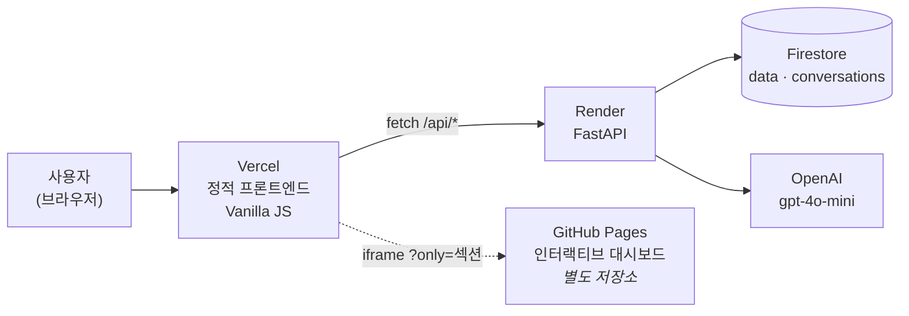
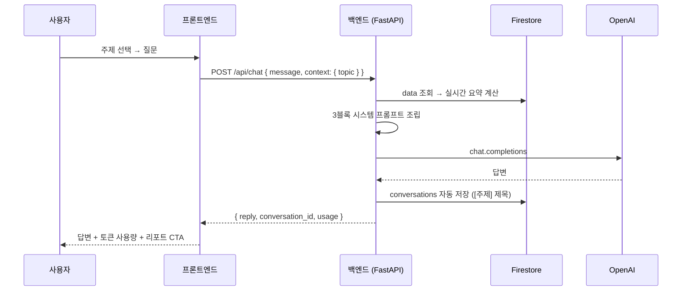
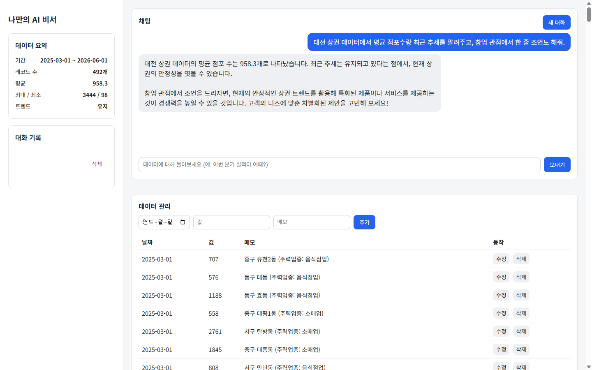
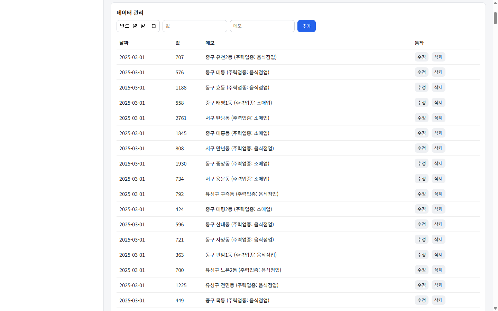
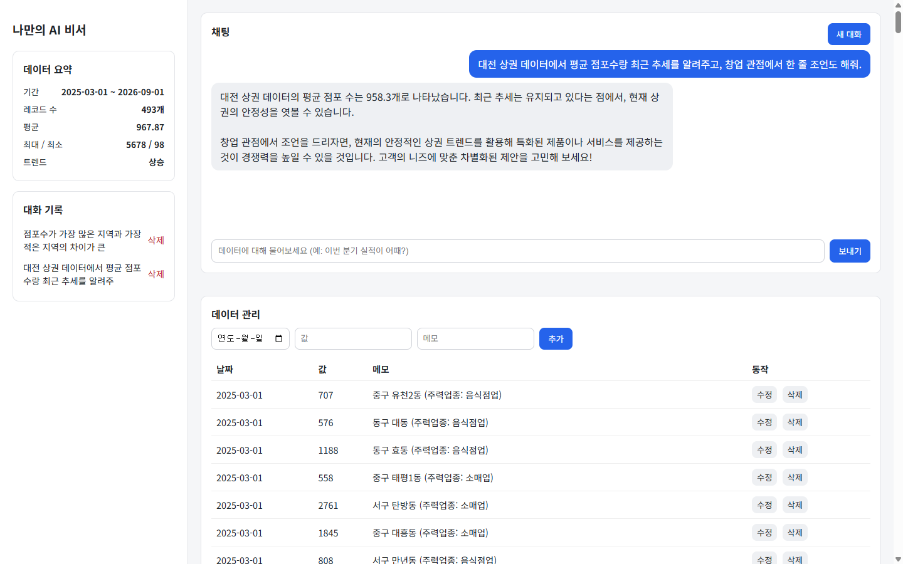
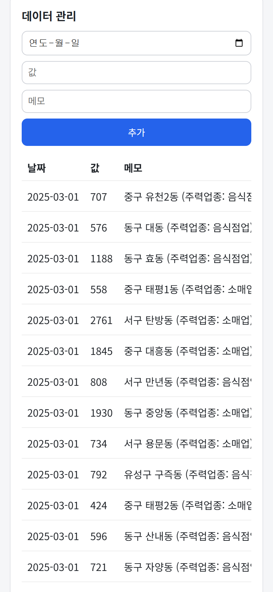

# 대전 상권분석 매니저

> **대전 82개 동 상권 흐름을 AI가 근거와 함께 설명합니다.**
> 지표를 대신 읽어주고, 모르는 건 모른다고 말하는 상권 분석.

    

| 대상 | URL |
|---|---|
| **서비스** | https://frontend-lovat-rho-rea8xhh8wq.vercel.app |
| 백엔드 API | https://my-data-assistant.onrender.com |
| Swagger UI | https://my-data-assistant.onrender.com/docs |

> ⚠️ 백엔드가 Render 무료 플랜이라 15분 유휴 후 첫 요청은 **30~50초** 걸립니다.
> **요청은 붙잡힌 채 자동 완료되므로 기다리시면 됩니다** — 화면이 경과 시간을 초 단위로 알려줍니다.

---

## 1. 문제

상권 데이터는 이미 공개돼 있습니다. 문제는 **읽을 줄 아는 사람이 적다**는 것입니다.

"잔존율 73.7%"가 좋은 건지 나쁜 건지, "LQ 3.48"이 무슨 뜻인지, 대시보드는 알려주지 않습니다. 그렇다고 ChatGPT에 물으면 **내 데이터를 모르니** 일반론만 돌아옵니다.

반대편 문제도 있습니다. 상권 분석 서비스들은 확신에 찬 어조로 "유망 상권"을 지목합니다. 그런데 공개 데이터에는 **매출도 유동인구도 없습니다.** 점포 수만 가지고 창업을 권하는 건 보증할 수 없는 것을 보증하는 일입니다.

## 2. 해법

**지표를 대신 읽어주되, 알 수 없는 것은 알 수 없다고 말한다.**

```
주제를 고른다  →  실제 대시보드 패널이 열린다  →  AI가 그 주제 기준으로 답한다  →  리포트로 가져간다
```

세 가지를 지킵니다.

| | |
|---|---|
| **근거를 가리킨다** | 답변의 수치는 실제 데이터에서 나오고, 원본 대시보드로 바로 넘어갈 수 있다 |
| **한계를 먼저 말한다** | 매출·유동인구 미포함을 화면 상단에 상시 노출하고, 리포트의 마지막 블록은 항상 `한계`다 |
| **결정을 대신하지 않는다** | "유망하다·추천한다" 같은 어휘를 프롬프트 차원에서 금지했다 |

> **증감에 초록/빨강을 쓰지 않습니다.** 관습은 `증가=초록(좋음)`이지만 우리 데이터로는 그 판단을 할 수 없습니다. 실제 반례가 있습니다 — 목동은 잔존율 최저(73.7%)인데 +5.3% 늘었고, 대흥동은 밀도 2위인데 +0.4%로 멈췄습니다. 제품 판단이 시각 규칙이 된 사례입니다.

---

## 3. 아키텍처

### 배포 토폴로지



대시보드는 **재구현하지 않고 임베드**합니다. 이전 분석 프로젝트([daejeon-commercial-analysis](https://github.com/Frost0313z/daejeon-commercial-analysis))의 산출물을 GitHub Pages에 두고, `?only=` 파라미터로 필요한 패널만 잘라 iframe으로 띄웁니다. 시각화를 **이중 관리하지 않는 것**이 핵심 이득입니다.

### 요청 흐름



---

## 4. 기술적 핵심 — 3블록 컨텍스트 주입

파인튜닝도 RAG도 아닌 **컨텍스트 주입**을 택했습니다. 데이터가 492건으로 작고 구조가 고정돼 있어, 검색 계층을 두는 비용보다 프롬프트에 통째로 넣는 편이 단순하고 정확합니다.

시스템 프롬프트는 성격이 다른 세 블록으로 구성됩니다.

| 블록 | 갱신 주기 | 출처 | 역할 |
|---|---|---|---|
| `[실시간 데이터 요약]` | **매 요청** 재계산 | Firestore `data` | 기간·개수·평균/최대/최소·추세 |
| `[사전 분석 리포트]` | 고정 스냅샷 | `backend/app/seed/insights.md` | 자치구·업종별 성장률, 공급밀도·LQ·잔존율·교체율 |
| `[선택한 분석 주제]` | 사용자 조작 시 | 화면의 주제 버튼 | 지금 무엇을 보고 있는지 |

**왜 나눴는가.** 실시간 요약만으로는 "평균·추세" 수준의 답만 가능합니다. 고정 리포트만 쓰면 데이터를 편집해도 답이 바뀌지 않습니다. 둘을 합치면 어느 쪽 수치를 믿어야 할지 모델이 혼동합니다. 그래서 블록을 **명확히 라벨링하고 우선순위 규칙을 명시**했습니다 — "수치는 실시간 요약 우선, 배경·세부는 리포트 활용, 리포트에 없는 값은 지어내지 말 것".

세 번째 블록이 이 프로젝트의 차별점입니다. 화면 상태가 프롬프트로 들어가므로, 같은 질문("이 주제 핵심이 뭐야?")이라도 **사용자가 보고 있는 패널에 따라 답이 달라집니다.** 주제를 바꾸면 프롬프트 규칙이 "현재 주제가 대화 이력보다 우선"이라고 지시해 이전 주제 이야기를 이어가지 않습니다.

### 주제 리포트 (Primary Goal)

답변 뒤 `이 주제 전체 리포트 보기`를 누르면 `context.mode = "report"`가 실려 가고, 프롬프트가 네 블록 구조를 강제합니다.

```
## 요약        결론 먼저, 3문장 이내
## 핵심 수치    실제로 존재하는 값만, 3~5개
## 해석        원인을 단정하지 않고 가능한 설명으로
## 한계        생략 불가 — 매출·유동인구 부재를 반드시 포함
```

`한계` 블록이 빠지면 경쟁 서비스와의 차별점이 사라지므로 프롬프트에서 생략을 금지했습니다. 리포트는 별도 엔드포인트가 아니라 채팅 턴이라 대화 이력·제목·토큰 표시를 그대로 재사용합니다.

---

## 5. 로컬 실행

### 백엔드

```bash
cd backend
python -m venv venv
venv\Scripts\activate          # Windows (macOS/Linux: source venv/bin/activate)
pip install -r requirements.txt
cp .env.example .env           # 값 채우기 (부록 C)
python scripts/seed_firestore.py   # 최초 1회: 시드 492개 적재
uvicorn main:app --reload
```

`http://localhost:8000/docs` 에서 Swagger UI 확인.

### 프론트엔드

```bash
cd frontend && python -m http.server 5500
```

로컬에서는 `js/config.js`의 기본값 `http://localhost:8000`이 그대로 쓰입니다. 배포 시에는 `frontend/build.js`가 Vercel 환경변수 `API_BASE_URL`을 읽어 플레이스홀더를 치환합니다.

> 로컬 포트를 바꾸면 백엔드 `.env`의 `ALLOWED_ORIGINS`도 맞춰야 합니다. 안 맞으면 CORS 실패가 나는데, 브라우저에는 콜드스타트와 똑같은 `Failed to fetch`로 보입니다.

---

## 6. 주요 의사결정

| 결정 | 선택 | 트레이드오프 |
|---|---|---|
| **컨텍스트 주입 vs 파인튜닝/RAG** | 컨텍스트 주입 | 데이터가 작고 고정적이라 검색 계층 비용이 이득보다 크다. 데이터가 커지면 재검토 필요 |
| **대시보드 임베드 vs 재구현** | iframe 임베드 | 시각화 이중 관리를 피한다. 대신 임베드 패널의 팔레트를 우리가 못 바꾼다 |
| **증감 색 중립화** | 초록/빨강 대신 중립 2색 | 관습을 깨서 첫인상은 낯설다. 그러나 매출이 없는 데이터로 선악을 표시하면 거짓말이 된다 |
| **인증 제외** | 미포함 | "개인 상권 분석 도구"로 범위를 좁혀 서사를 세웠다. 다중 사용자는 비범위 |
| **바닐라 JS** | 프레임워크 없음 | 미션 제약이자, 빌드 스텝이 환경변수 주입 1개뿐이라 배포가 단순하다 |

전체 결정 이력은 [`docs/decisions.md`](docs/decisions.md), 설계 근거는 [`docs/identity.md`](docs/identity.md) · [`docs/design/`](docs/design/)에 있습니다.

---

## 7. 알려진 제약

- **콜드스타트** — Render 무료 티어. 요청 자체는 자동 완료되며, 화면이 경과 초와 상태를 알립니다.
- **매출·유동인구 없음** — 이 데이터로는 상권의 수익성을 판단할 수 없습니다. 서비스가 이 한계를 숨기지 않고 화면과 리포트에 명시합니다.
- **`GET /api/data?limit=N`의 `limit`이 무시**되고 전체(492건)를 반환합니다. 목록이 커지면 서버측 페이지네이션이 필요합니다.
- **인증/사용자 구분 없음** — 단일 사용자용 데모.
- Vercel의 `frontend-<hash>-...-projects.vercel.app` 형태 URL은 팀 인증(302)이 걸립니다. 공개 접근은 상단의 별칭 URL을 사용하세요.

---

# 부록 — 미션 채점 항목

> 코디세이 AI Native Advanced · **"AI Agent 개발: 나만의 AI 비서 구축"** 미션 제출 내용을 보존한 섹션입니다.

## A. 데이터 선정 및 분석

이전 프로젝트 [daejeon-commercial-analysis](https://github.com/Frost0313z/daejeon-commercial-analysis)에서 만든 `dong_indicators_timeseries.csv`를 재사용합니다.

- **원본**: 대전 82개 행정동 × 6개 분기(2025-03 ~ 2026-06)의 점포수
- **변환**: `backend/scripts/prepare_seed_data.py`가 행정동×분기를 개별 레코드로 풀어 **`(date, value, memo)` 492개**로 변환 → `backend/app/seed/seed_data.json`
- **적재**: `backend/scripts/seed_firestore.py`가 이 JSON을 Firestore `data` 컬렉션에 배치 write

| 필드 | 의미 | 예 |
|---|---|---|
| `date` | 조사 시점 (분기 단위) | `2025-03-01` |
| `value` | 해당 행정동의 점포수 | `1930` |
| `memo` | "구 동 (주력업종: OO업)" | `동구 중앙동 (주력업종: 소매업)` |

**요약 계산** (`GET /api/data/summary`): 레코드를 날짜순 정렬 후 기간·개수·평균/최대/최소, 그리고 추세를 **앞 절반 평균 vs 뒤 절반 평균**으로 판정(증가/감소/유지)합니다. 현재 시드 기준: 기간 `2025-03-01 ~ 2026-06-01`, 492개, 평균 `958.3`, 최대/최소 `3444 / 98`, 추세 `유지`.

**데이터 구조 선택 이유**: 미션이 요구하는 `(date, value, memo)` 단순 시계열 스키마에 맞추면서도, 이미 검증된 실제 분석 데이터를 재사용해 "억지로 만든 숫자"가 아닌 의미 있는 데이터를 쓰고 싶었습니다.

## B. API 엔드포인트

| 메서드 | 경로 | 설명 |
|---|---|---|
| GET | `/api/data` | 데이터 목록 조회 |
| POST | `/api/data` | 데이터 추가 (Pydantic 검증: `value`는 숫자) |
| PUT | `/api/data/{id}` | 데이터 수정 |
| DELETE | `/api/data/{id}` | 데이터 삭제 |
| GET | `/api/data/summary` | 요약 정보 (프롬프트 주입용) |
| GET | `/api/conversations` | 대화 목록 조회 (목록에는 `messages` 생략) |
| POST | `/api/conversations` | 대화 통째로 저장 (보조 경로) |
| GET | `/api/conversations/{id}` | 대화 상세 — `messages` 전체 포함 (**불러오기용**) |
| DELETE | `/api/conversations/{id}` | 대화 삭제 |
| POST | `/api/chat` | AI 채팅 (요약 조회 → 프롬프트 주입 → GPT 호출 → 대화 자동 저장) |

`GET /api/conversations`는 목록 응답에서 `messages`를 `null`로 생략하고, 개별 대화를 열 때 `GET /api/conversations/{id}`로 전체 메시지를 가져옵니다(미션 옵션 A).

**라우터/서비스 분리 기준**: 라우터는 HTTP 계약(경로·요청/응답 스키마)만 담당하고, Firestore·OpenAI 호출 등 실제 로직은 `services/`에 몰아 테스트와 재사용이 쉽게 했습니다.

**대화 저장 정책**: `/api/chat`은 매 턴마다 자동 저장(`conversation_id`가 없으면 새 대화 생성, 있으면 이어붙임). 제목은 대화를 처음 만들 때만 `[주제] 첫 질문` 형태로 정합니다.

## C. 환경 변수

| 변수 | 위치 | 필수 | 설명 |
|---|---|:---:|---|
| `OPENAI_API_KEY` | 백엔드 | ✅ | OpenAI API 키 (`sk-...`) |
| `FIREBASE_SERVICE_ACCOUNT_JSON` | 백엔드 | ✅ | 서비스 계정 키 — **로컬은 파일 경로**, **Render는 JSON 문자열 전체** |
| `ALLOWED_ORIGINS` | 백엔드 | ✅ | CORS 허용 오리진(콤마 구분). 프론트 배포 URL 포함 |
| `OPENAI_MODEL` | 백엔드 |  | 기본값 `gpt-4o-mini` |
| `CHAT_MAX_TOKENS` | 백엔드 |  | 일반 답변 토큰 상한 (기본 `500`, 과금 방지) |
| `REPORT_MAX_TOKENS` | 백엔드 |  | 주제 리포트 토큰 상한 (기본 `1200`) — 4블록을 채워야 해 상한이 다르다 |
| `API_BASE_URL` | 프론트엔드(Vercel) | ✅ | 백엔드 배포 URL. 빌드 시 `build.js`가 `js/config.js`에 주입 |

`.env`와 `firebase-service-account.json`은 `.gitignore`에 포함되어 저장소에 올라가지 않습니다.

**키 관리가 왜 필요한가**: OpenAI 키와 Firebase 서비스 계정 키는 유출 시 과금·데이터 침해로 직결됩니다. 코드에 하드코딩하지 않고 (1) 로컬은 `.env`(+ `.gitignore`), (2) 배포는 Render/Vercel의 암호화된 환경변수로만 다룹니다. 저장소는 public이라 키가 커밋되면 즉시 노출됩니다.

**CORS가 왜 필요한가**: 프론트(`*.vercel.app`)와 백엔드(`*.onrender.com`)는 **다른 오리진**입니다. 브라우저 동일 출처 정책상, 백엔드가 `Access-Control-Allow-Origin` 헤더로 프론트 오리진을 명시적으로 허용하지 않으면 `fetch`가 차단됩니다.

## D. 입력 검증 / 출력 처리 규칙

신뢰 경계(브라우저 → API)에서 들어오는 값은 **화이트리스트 방식**으로 좁히고, 화면에 다시 그릴 때는 **DOM 텍스트 노드로만** 출력합니다.

### 입력 검증 (백엔드 · `backend/app/models.py`)

| 필드 | 규칙 |
|---|---|
| `date` | 정규식 `^\d{4}-\d{2}-\d{2}$` + 실제 달력상 유효한 날짜(`date.fromisoformat`)만 허용 |
| `value` | 유한 실수만. `NaN`/`Inf` 거부(`allow_inf_nan=False`), 범위 `-1e12 ~ 1e12` |
| `memo` | 최대 500자. ASCII 제어문자(0x00–0x1F, 0x7F) 제거 후 저장 |
| `chat.message` | 1자 이상 2000자 이하. 제어문자 제거, 공백만 있으면 거부 |
| `chat.context` | 허용 키 `topic`·`mode`·`persona`·`regionType` 4개만(`CONTEXT_KEYS`). 뒤 3개는 **값도 화이트리스트** — `mode`=`report` / `persona` 3종 / `regionType` 5종. 프롬프트에 들어갈 문구는 전부 백엔드가 갖는다(프론트는 열쇠만 보낸다). 그 외는 무시 |
| `conversation.title` | 최대 100자, 제어문자 제거 |
| `chat message.content` | 최대 8000자, 제어문자 제거 |

위반 시 FastAPI가 `422 Unprocessable Entity`와 위반 필드를 반환합니다. 규칙은 `backend/test_models.py`(`python test_models.py`)로 검증합니다.

### 출력 이스케이프 (프론트엔드)

사용자·AI가 만든 문자열(대화 제목, memo, date로 조립된 요약 문구)은 **`innerHTML` 템플릿으로 조립하지 않습니다.** `document.createElement` + `element.textContent`로만 DOM에 넣어 브라우저가 자동 이스케이프하도록 합니다(`js/data.js`, `js/history.js`, `js/summary.js`, `js/topics.js`). 채팅 말풍선도 `textContent` 사용. 따라서 `` 같은 memo·제목을 넣어도 텍스트로 표시되고 실행되지 않습니다.

### 다중 방어

- 백엔드 제어문자 제거 = 저장 데이터 오염 방지 + 프롬프트 주입 표면 축소
- 프론트 `textContent` = 저장된 값이 오염됐더라도 실행 차단
- CORS 허용 오리진 화이트리스트(`ALLOWED_ORIGINS`)로 타 사이트에서의 호출 차단

## E. 제출 스크린샷

> 코디세이 AI 사전평가는 이미지를 읽지 못하므로, 각 스크린샷 아래에 **입력 → 실제 출력**을 텍스트로 함께 적습니다.

### E-1. 데이터 요약이 반영된 채팅 화면



- **입력(질문)**: "대전 상권 데이터에서 평균 점포수랑 최근 추세를 알려주고, 창업 관점에서 한 줄 조언도 해줘."
- **사이드바 요약**: 기간 `2025-03-01 ~ 2026-06-01`, 레코드 수 `492개`, 평균 `958.3`, 최대/최소 `3444 / 98`, 트렌드 `유지`
- **AI 실제 답변(발췌)**: "대전 상권 데이터의 평균 점포 수는 **958.3개**로 나타났습니다. 최근 추세는 **유지**되고 있다는 점에서, 현재 상권의 안정성을 엿볼 수 있습니다. … 안정적인 상권 트렌드를 활용해 특화된 제품이나 서비스를 제공하는 것이 경쟁력을 높일 수 있을 것입니다."
- **확인 포인트**: 답변의 `958.3`, `유지`는 프런트가 만든 값이 아니라 **백엔드가 `/api/data/summary`를 계산해 시스템 프롬프트로 주입한 값**이 그대로 반영된 것.

### E-2. 데이터 관리 화면 (CRUD 동작)



- **추가(Create)**: 폼에 `2026-09-01 / 1234 / "데모: 신규 상권 데이터 추가 테스트"` 입력 → "추가" → 목록에 493번째 행으로 나타남.
- **수정(Update)**: 그 행의 "수정" → 폼이 값으로 채워지고 버튼이 "수정 저장"으로 바뀜 → 값을 `1234 → 5678`, 메모를 "데모: 수정 동작 확인"으로 바꿔 저장 → 목록에 반영됨.
- **삭제(Delete)**: 각 행의 "삭제" 버튼. (스크린샷 촬영 후 데모용 레코드는 삭제해 시드 492개 상태로 되돌림.)
- Pydantic 검증: `value`에 문자열을 넣으면 `422 Unprocessable Entity`.

### E-3. 대화 기록 불러오기 화면



- **상황**: 대화 2건 저장됨 — ① "점포수가 가장 많은 지역과 가장 적은 지역의 차이가 큰…" ② "대전 상권 데이터에서 평균 점포수랑 최근 추세를 알려주…"
- **동작**: 사이드바 "대화 기록"에서 ②를 클릭 → 채팅창에 ②의 질문·답변 전체가 복원됨(`GET /api/conversations/{id}`).
- **확인 포인트**: 목록 항목의 제목이 정상 표시되고, 클릭 한 번으로 과거 대화가 그대로 재현됨.

### E-4. 모바일 화면 — 채팅 (뷰포트 390×844, iPhone 12 상당)


- **레이아웃**: 데스크톱의 좌측 사이드바(요약·대화 기록)가 상단으로 접히고, 채팅·데이터 관리가 세로 1열로 쌓임.
- **채팅 입력**: `.chat-input-row`가 세로로 전환돼 입력창과 "보내기" 버튼이 각각 가로 전체를 차지(터치 타깃 확보).
- **동작 확인**: 모바일 뷰에서 "모바일에서 잘 되나 확인 중…" 질문 전송 → AI가 `기간 2025년 3월 1일 ~ 2026년 6월 1일, 평균 958.3` 응답. 말풍선 `max-width: 85%`로 화면 밖으로 넘치지 않음.

### E-5. 모바일 화면 — 데이터 관리 (반응형 폼)



- **추가 폼**: `.data-form`이 `flex-direction: column`으로 전환돼 날짜/값/메모 입력이 한 줄에 하나씩, "추가" 버튼은 가로 전체.
- **넓은 표**: `.data-table`이 `display: block; overflow-x: auto`로 바뀌어 표만 가로 스크롤되고, **페이지 자체는 가로 스크롤이 생기지 않음**(`document.documentElement.scrollWidth === window.innerWidth === 390` 확인).

### E-6. 반응형 CSS 미디어쿼리

| 브레이크포인트 | 목적 | 주요 변경 |
|---|---|---|
| `@media (max-width: 1180px)` | 좁은 데스크톱 | 3분할 폭 축소 (`288/400px` → `248/340px`), 분할 자체는 유지 |
| `@media (max-width: 900px)` | 태블릿 이하 | 3분할 그리드를 1열로 접고 **한 번에 한 패널만** 표시. JS가 `.pane-active`를 옮기고 하단 탭바(분석 ↔ 채팅 ↔ 데이터)로 전환 |
| `@media (max-width: 480px)` | 모바일 | 채팅 입력을 세로 1열로, 버튼 가로 전체(터치 타깃 확보), 말풍선 `max-width: 88%` |

**반응형 전략**: 데스크톱을 기본으로 만들고 `max-width` 미디어쿼리로 좁은 화면을 덮는 방식(모바일 퍼스트의 반대). 좁은 화면에서 3분할을 세로로 쌓지 않고 **탭 전환**을 택한 이유는, 대시보드 임베드와 채팅을 세로로 이으면 스크롤이 너무 길어져 둘 다 못 쓰게 되기 때문입니다.

> 위 E-4·E-5 스크린샷은 **3분할 레이아웃(A1) 도입 이전**에 촬영한 것이라 현재 화면과 다릅니다. 재촬영은 E3(데모 시나리오)에서 함께 처리할 예정입니다.

## F. 프로젝트 구조

```
my-data-assistant/
├── backend/
│   ├── main.py                  # FastAPI 앱 초기화 + CORS + 라우터 등록
│   ├── app/
│   │   ├── config.py            # 환경변수 로딩 (python-dotenv)
│   │   ├── firestore_client.py  # 서비스 계정으로 Firestore 초기화
│   │   ├── models.py            # Pydantic 요청/응답 스키마 + 입력 검증
│   │   ├── routers/             # data / conversations / chat — HTTP 계약만
│   │   ├── services/            # Firestore·OpenAI 호출 등 실제 로직
│   │   └── seed/
│   │       ├── seed_data.json   # 시드 데이터 492개
│   │       └── insights.md      # 사전 분석 리포트(고정) — 프롬프트 2번 블록
│   ├── scripts/                 # 시드 준비·적재
│   └── requirements.txt
├── frontend/
│   ├── index.html
│   ├── css/style.css
│   ├── js/                      # config·api·topics·topics-data·tabs·summary·chat·data·history
│   ├── build.js                 # 배포 시 API_BASE_URL 주입
│   └── vercel.json
└── docs/                        # 스펙·설계·의사결정 기록
```

## G. 기타 설계 노트

- **동명 항목·값 충돌 처리**: 데이터 레코드는 Firestore 자동 생성 ID로 구분하므로 같은 날짜·값이 중복돼도 별개 레코드로 취급합니다.
- **지속성(persistence) 제안**: 현재는 Firestore가 유일한 저장소입니다. 오프라인 백업이 필요하면 `seed_firestore.py`의 역방향 스크립트(`dump_firestore.py`)로 `data`/`conversations`를 JSON으로 내보내 버전 관리하는 방식을 우선 검토합니다.
- **프롬프트 크기 관리**: 원본 492행이 아니라 **요약 통계만** 주입해 프롬프트 크기를 일정하게 유지합니다.

---

## 라이선스

MIT
