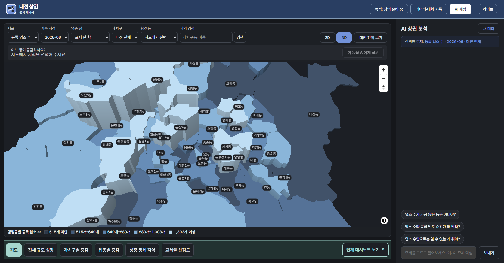
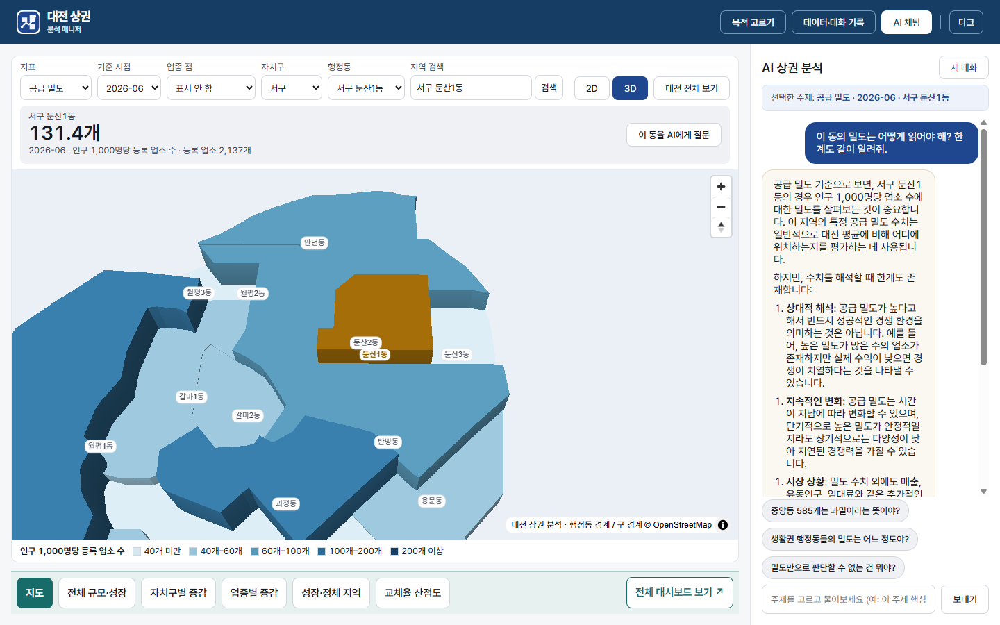
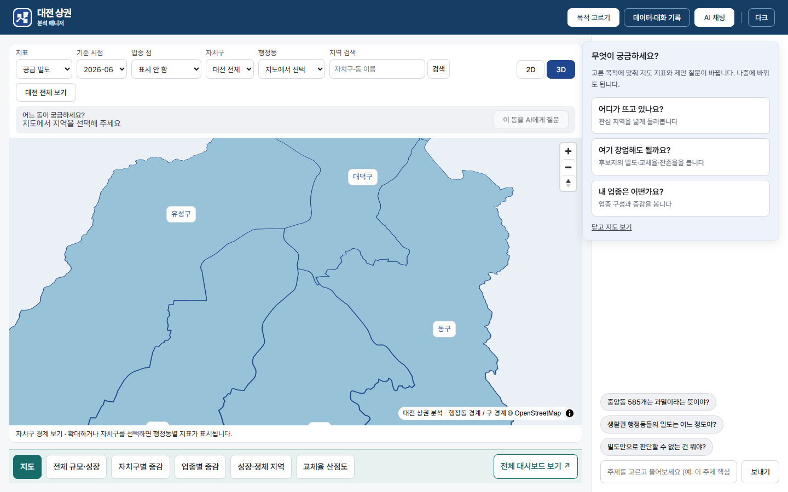
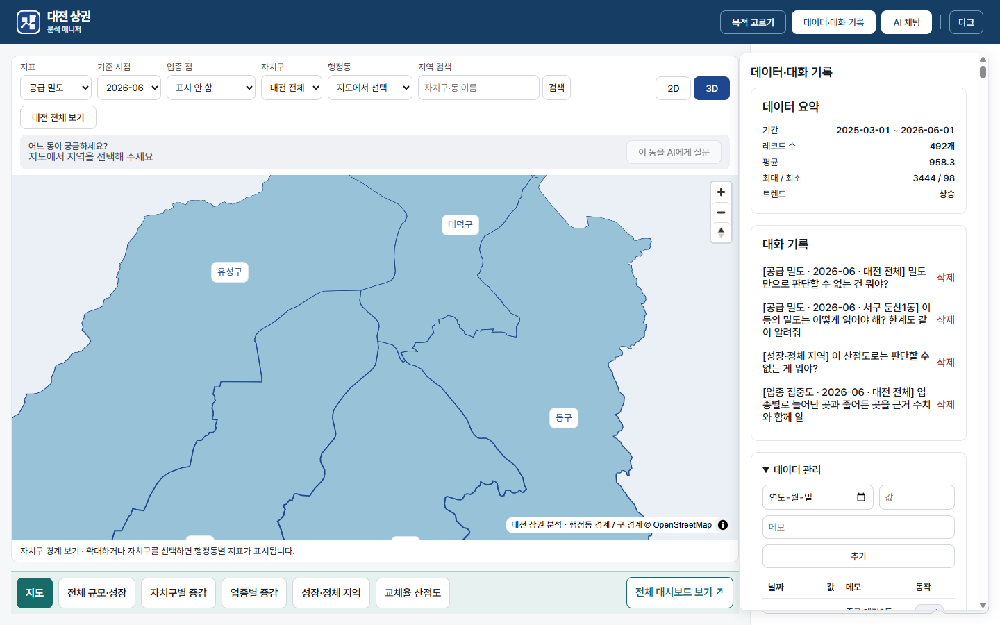
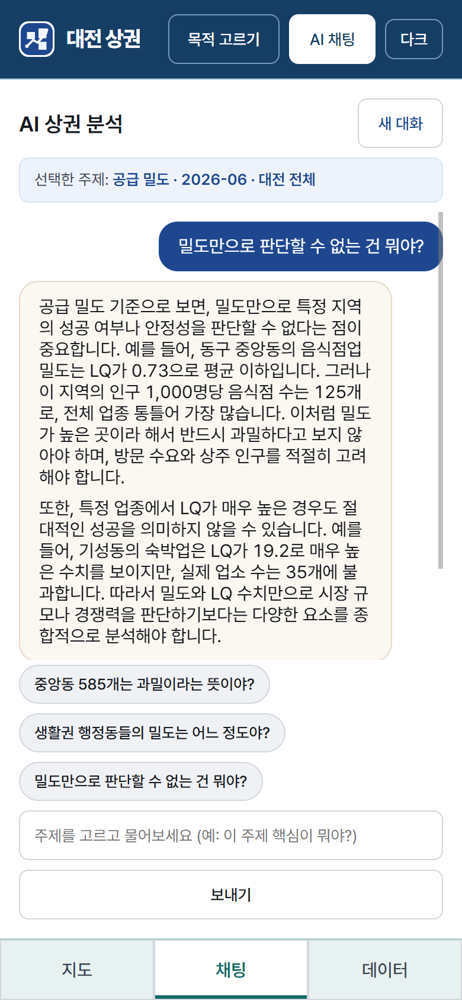
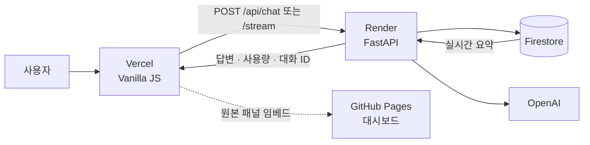

<div align="center">

# 대전 상권분석 매니저

### 숫자를 보여주는 데서 멈추지 않고, 읽는 법과 한계까지 설명하는 AI 상권 분석 도구

[서비스 열기](https://frontend-lovat-rho-rea8xhh8wq.vercel.app) · [API 문서](https://my-data-assistant.onrender.com/docs) · [QA 체크리스트](QA.md)


</div>

<br />



<div align="center">
<sub>첫 화면입니다. 대전 <b>82개 행정동</b>의 등록 업소 수를 높이와 밝기로 한 번에 보여 줍니다 — 밝고 높을수록 업소가 많은 동입니다.<br />
지표를 바꾸면 같은 지도가 밀도 · 잔존율 · 교체율 · 업종 집중도 · 지역 유형으로 다시 그려집니다.</sub>
</div>

> [!NOTE]
> Render 무료 인스턴스는 15분 유휴 후 첫 요청에 30~50초가 걸릴 수 있습니다. 요청은 자동으로 완료되며, 화면이 경과 시간과 상태를 안내합니다.

## 왜 만들었나

공개 상권 데이터는 많지만, `잔존율 73.7%`, `LQ 3.48`, `점포 교체율` 같은 숫자는 해석하기 어렵습니다. 반대로 매출과 유동인구가 없는 데이터로 특정 지역을 “유망하다”고 말하는 것도 정직하지 않습니다.

대전 상권분석 매니저는 이 두 문제 사이에 섭니다.

| 원칙 | 제품에서의 구현 |
|---|---|
| **근거를 남긴다** | 지도·주제·원본 대시보드와 연결하고, 저장 데이터에서 계산한 요약을 답변에 반영합니다. |
| **한계를 숨기지 않는다** | 화면, 제안 질문, 리포트의 `한계` 섹션에 매출·유동인구 미포함을 명시합니다. |
| **결정을 대신하지 않는다** | “유망”, “추천”, “창업하세요”처럼 판단을 대신하는 어휘를 프롬프트 규칙에서 금지합니다. |
| **증감을 평가하지 않는다** | 증가=좋음이라는 인상을 피하기 위해 초록/빨강 관습 대신 중립적인 시각 언어를 사용합니다. |

```text
목적을 고른다 → 지도·주제를 살핀다 → AI에게 맥락 있는 질문을 한다 → 리포트로 정리한다
```



<div align="center">
<sub>동을 하나 고르면 그 수치가 화면에서 가장 크게 섭니다 — <b>서구 둔산1동, 인구 1,000명당 131.4개.</b><br />
오른쪽 AI는 숫자를 되풀이하지 않고 <b>어떻게 읽어야 하는지</b>와 <b>이 데이터로는 무엇을 알 수 없는지</b>를 함께 답합니다.</sub>
</div>

## 주요 기능

| | 기능 | 설명 |
|---:|---|---|
| 01 | **82개 행정동 지도** | 공급 밀도, 업소 수, 잔존율, 교체율, 업종 집중도, 지역 유형을 2D/3D로 탐색합니다. |
| 02 | **목적 기반 시작** | “어디가 뜨고 있나요?”, “여기 창업해도 될까요?”, “내 업종은 어떤가요?”에서 시작해 지표와 질문을 맞춥니다. |
| 03 | **맥락 있는 AI 채팅** | 선택한 주제·지도 지역·사용자 목적을 서버에서 검증한 뒤 프롬프트에 반영합니다. |
| 04 | **스트리밍 답변** | 토큰이 도착하는 대로 보여 주고, SSE가 막힌 환경에서는 일반 응답으로 안전하게 전환합니다. |
| 05 | **4단 리포트** | `요약 → 핵심 수치 → 해석 → 한계` 형식의 가져갈 수 있는 산출물을 만듭니다. |
| 06 | **데이터와 대화 관리** | 데이터 CRUD, 요약 갱신, 대화 자동 저장·불러오기·삭제를 제공합니다. |
| 07 | **지역 검색** | 자치구·행정동 이름으로 찾아 지도와 지표를 그 지역으로 옮깁니다. |
| 08 | **라이트 · 다크** | OS 설정을 따르되 버튼으로 덮어쓸 수 있고, 지도 색 램프도 어두운 배경에 맞춰 방향을 다시 잡습니다. |

<details>
<summary><b>화면 더 보기</b></summary>
<br />

| 처음 오면 목적부터 고릅니다 | 데이터와 대화 기록 |
|---|---|
|  |  |

<p align="center">

<br />
<sub>모바일에서는 지도 · 채팅 · 데이터를 하단 탭으로 오갑니다.</sub>
</p>

</details>

## 어떻게 동작하나



### AI가 참고하는 정보

답변을 만들 때 서로 성격이 다른 정보를 명시적으로 구분합니다.

| 블록 | 출처 | 갱신 | 역할 |
|---|---|---|---|
| 실시간 데이터 요약 | Firestore `data` | 매 요청 | 기간, 건수, 평균·최대·최소, 추세 |
| 사전 분석 리포트 | `backend/app/seed/insights.md` | 고정 스냅샷 | 자치구·업종·밀도·잔존율·교체율 해석 |
| 화면 컨텍스트 | 사용자의 주제·지도·목적 선택 | 사용자 조작 시 | “지금 보고 있는 것”을 기준으로 답하도록 고정 |

숫자 질문은 실시간 요약을 우선하고, 리포트에 없는 수치는 지어내지 않도록 지시합니다. 대화 이력은 최근 8개 메시지만 사용해 비용과 맥락 사이의 균형을 맞춥니다.

### 운영 안전장치

- 요청 모델·토큰·캐시 적중·추정 비용을 구조화 로그로 남깁니다.
- 분당 요청 수와 일일 토큰 예산으로 채팅 API 남용을 제한합니다.
- Firestore 요약은 짧은 TTL로 캐시하고, 데이터 쓰기 뒤 즉시 무효화합니다.
- 대화 저장은 Firestore transaction으로 처리해 동시 요청에서 턴이 덮이지 않게 합니다.
- 입력은 Pydantic으로 검증하고, 화면 출력은 `textContent` 중심으로 렌더링합니다.

## 기술 구성

| 영역 | 선택 | 이유 |
|---|---|---|
| Frontend | Vanilla JavaScript · CSS · MapLibre GL | 프레임워크 의존 없이 작고 투명한 정적 앱을 유지합니다. |
| Backend | FastAPI · Pydantic | API 계약, 입력 검증, OpenAPI 문서를 간결하게 유지합니다. |
| Data | Firebase Firestore | 데이터·대화의 영속성과 간단한 운영을 확보합니다. |
| AI | OpenAI Chat Completions | 스트리밍과 사용량 계측을 모두 지원합니다. |
| Deploy | Vercel + Render | 정적 프런트와 API를 분리해 독립적으로 배포합니다. |
| Quality | pytest · GitHub Actions | 외부 서비스 없이 Firestore·OpenAI를 모킹해 CI에서 검증합니다. |

## 로컬 실행

### 1) 백엔드

```powershell
cd backend
python -m venv .venv
.\.venv\Scripts\Activate.ps1
pip install -r requirements.txt -r requirements-dev.txt
Copy-Item .env.example .env
# .env에 OPENAI_API_KEY와 FIREBASE_SERVICE_ACCOUNT_JSON을 설정
python scripts/seed_firestore.py  # 최초 1회, 시드 데이터 적재
uvicorn main:app --reload
```

실행 뒤 [http://localhost:8000/docs](http://localhost:8000/docs)에서 API 문서를 확인할 수 있습니다.

### 2) 프런트엔드

```powershell
cd frontend
python -m http.server 5500
```

브라우저에서 [http://localhost:5500](http://localhost:5500)을 엽니다. 기본 API 주소는 `http://localhost:8000`이며, 포트를 바꿨다면 백엔드의 `ALLOWED_ORIGINS`도 맞춰야 합니다.

### 환경 변수

| 변수 | 필수 | 설명 |
|---|:---:|---|
| `OPENAI_API_KEY` | 예 | OpenAI API 키 |
| `FIREBASE_SERVICE_ACCOUNT_JSON` | 예 | 로컬에서는 서비스 계정 파일 경로, 배포에서는 JSON 문자열 |
| `ALLOWED_ORIGINS` | 예 | 콤마로 구분한 프런트엔드 허용 오리진 |
| `CHAT_MAX_TOKENS` | 아니오 | 일반 답변 출력 상한, 기본 `900` |
| `REPORT_MAX_TOKENS` | 아니오 | 4단 리포트 출력 상한, 기본 `1200` |
| `HISTORY_MAX_MESSAGES` | 아니오 | 프롬프트에 넣는 최근 대화 메시지 수, 기본 `8` |
| `DATA_WRITES_ENABLED` | 아니오 | 데이터 추가·수정·삭제 허용, **기본 꺼짐(읽기 전용)**. 공개 데모에서는 켜지 않는다 — 누가 지우면 모두에게 지워진다 |
| `CHAT_RATE_PER_MINUTE` | 아니오 | IP 기준 분당 채팅 요청 상한, 기본 `10` |
| `TRUSTED_PROXY_HOPS` | 아니오 | 레이트리밋 키를 `X-Forwarded-For` 오른쪽에서 몇 번째로 셀지, 기본 `1`(Render). 프록시가 없으면 `0` |
| `DAILY_TOKEN_BUDGET` | 아니오 | 일일 전체 토큰 예산, 기본 `300000`. 심사·발표처럼 트래픽이 몰리는 날은 미리 올려 둔다 |

> `.env`와 Firebase 서비스 계정 파일은 절대 커밋하지 않습니다.

## API 한눈에 보기

| Method | Endpoint | 설명 |
|---|---|---|
| `GET` | `/` | 헬스체크와 배포 빌드 식별자 |
| `GET` | `/api/data` | 데이터 레코드 목록 |
| `POST / PUT / DELETE` | `/api/data` | 데이터 생성·수정·삭제 |
| `GET` | `/api/data/summary` | 선택 필터 기준 요약 |
| `GET` | `/api/data/dimensions` | 필터 선택지 |
| `POST` | `/api/chat` | 일반 채팅 응답 |
| `POST` | `/api/chat/stream` | SSE 스트리밍 채팅 |
| `GET / POST / DELETE` | `/api/conversations` | 대화 기록 관리 |
| `POST` | `/api/dev/reset` | 토큰 설정 시에만 가능한 데모 데이터 복구 |

상세 스키마와 요청 예시는 [Swagger UI](https://my-data-assistant.onrender.com/docs)에서 확인할 수 있습니다.

## 품질 확인

PR과 `main` 푸시마다 GitHub Actions가 다음을 실행합니다.

```text
backend  →  pytest
frontend →  node --check → node build.js → Markdown XSS 검사 → 지도 데이터 무결성 검사
```

수동 확인은 [QA.md](QA.md)의 시나리오를 따릅니다. 특히 스트리밍, 429 제한, WebGL 폴백, 모바일 탭, 다크 모드, 데이터 CRUD 뒤 요약 갱신을 점검합니다.

## 프로젝트 구조

```text
.
├── backend/
│   ├── app/
│   │   ├── routers/       # HTTP 계약
│   │   ├── services/      # 채팅·데이터·대화·시드 로직
│   │   ├── models.py      # Pydantic 입력/출력 모델
│   │   ├── ratelimit.py   # 요청·토큰 예산 관리
│   │   └── seed/          # 분석 리포트와 시드 데이터
│   └── tests/             # Firestore·OpenAI 모킹 pytest
├── frontend/
│   ├── js/                # 화면·지도·채팅·마크다운 렌더링
│   ├── css/               # 반응형·테마 스타일
│   ├── data/              # 지도 경계·업종 점 데이터
│   └── scripts/           # 정적 데이터·렌더러 검증
├── docs/                  # 제품·데이터·운영 스펙과 의사결정
└── QA.md                  # 수동 QA 체크리스트
```

## 알려진 한계

- 매출과 유동인구가 없어 실제 수익성이나 창업 적합성을 판단할 수 없습니다.
- 인증과 사용자별 데이터 분리는 의도적으로 범위에서 제외한 단일 사용자 데모입니다. 그래서 **공개 배포는 읽기 전용**이며, 데이터 CRUD는 로컬 실행에서 확인할 수 있습니다.
- Render 무료 플랜의 콜드스타트 지연이 있습니다.
- 데이터가 커지면 목록 페이지네이션과 검색/RAG 전략을 다시 검토해야 합니다.

## 더 읽기

- [제품·UX 스펙](docs/specs/A-product-ux.md)
- [데이터 스펙](docs/specs/B-data.md)
- [신뢰성·운영 스펙](docs/specs/C-reliability-ops.md)
- [디자인 시스템](docs/design/design-system.md)
- [의사결정 기록](docs/decisions.md)
- [로드맵](docs/roadmap.md)

---

<div align="center">
  <sub>공개 데이터를 더 정직하게 읽기 위한 실험입니다.</sub>
</div>
